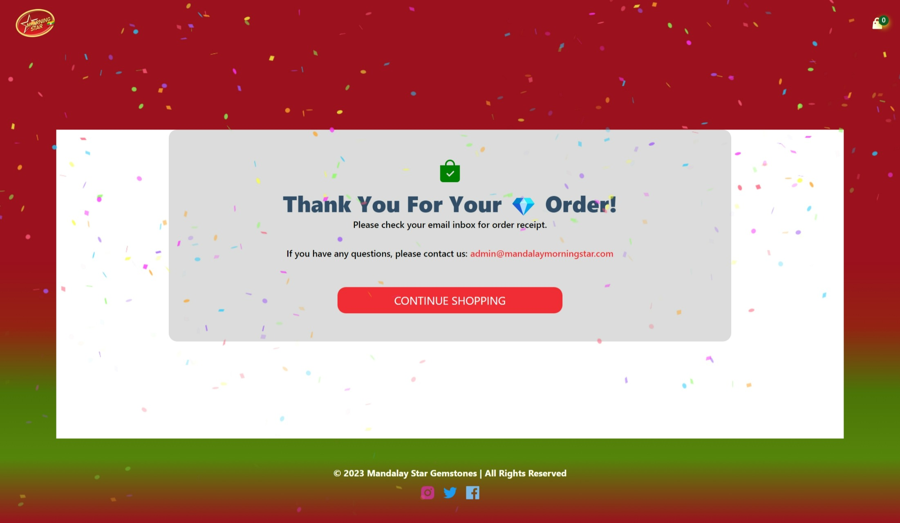

# Project Title: [ E_Commerce_Stripe_Sanity_NextJS_App ]

Deployed on Vercel Live URL: [ https://e-commerce-stripe-sanity-nextjs-app.vercel.app/ ]

## Table of Contents
1. [Description](#description)
2. [Installation](#installation)
3. [Usage](#usage)
4. [Contributing](#contributing)
5. [Tests](#tests)
6. [License](#license)
7. [Questions](#questions)

-----

### Description 
This Next.js e-commerce application will provide a modern design and animations to create an engaging user experience. It will include the ability to add and edit products on the go using a Sanity studio backend management system and Next.js for backend endpoints/server-side rendering and static generation. The application will also include all advanced cart and checkout functionalities, such as the ability to add multiple items to the cart, apply discounts, and calculate taxes. Most importantly, the application will be completely integrated with Stripe so that users can make real payments. The application will also be optimized for mobile devices, ensuring a smooth and seamless experience for users regardless of the device they are using. Finally, the application will be secured with SSL encryption to ensure the safety and security of all user data.

-----

### Installation

Next.js,

Node.js,

Sanity Client,

Stripe Payments

### Tech-Stacks
React,

Next JS,

Sanity,

Email JS,

Stripe

-----

### Usage 

Open Source MIT

-----

#### User Story

As a user, I want to be able to easily navigate an e-commerce website with modern design and animations, so that I can find the products I am looking for quickly and easily. I also want to be able to add and edit products on the go using a Sanity studio backend management, so that I can keep my store up to date. Additionally, I want to have all advanced cart and checkout functionalities, so that I can easily purchase the products I want. Finally, I want the complete integration with Stripe so that I can cover real payments.

#### Acceptance Criteria:

- The website should have modern design and animations
- The website should have a Sanity studio backend management for adding and editing products on the go
- Use NextJS to create backend endpoints
- The website should have all advanced cart and checkout functionalities
- The website should have complete integration with Stripe for real payments

-----

### Contributing 
YES 

-----

### Tests 
Jest

-----

### License 
MIT 

-----

Deployed on Vercel Live URL: [ https://e-commerce-stripe-sanity-nextjs-app.vercel.app/ ]

### Questions 

#### GitHub Username: min-hinthar 

#### GitHub URL: https://github.com/min-hinthar

#### GitHub Repo: https://github.com/min-hinthar/e_commerce_stripe_sanity_react_app

#### Email: min@mandalaymorningstar.com

-----
